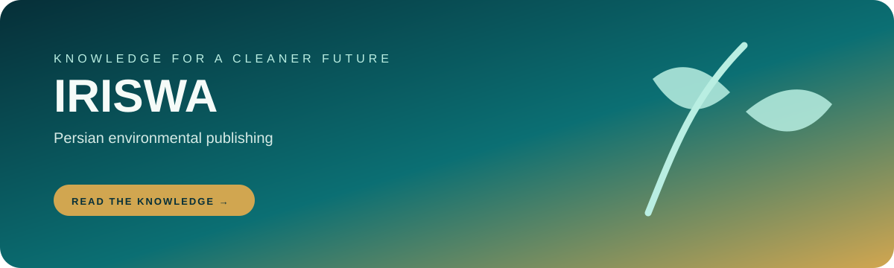

  

  <h1>IRISWA · انجمن مدیریت پسماند ایران</h1>
  
<strong>A Persian publishing system for environmental knowledge, events, courses, and solid-waste practice.</strong>

  

    <a href="https://soheil-aghayani.github.io/iriswa/"><strong>Open the live website →</strong></a>
  

  

    
    
    
  

---

## What this repo does

IRISWA combines a Persian environmental website with a small content pipeline. Markdown content, reusable layout sections, and a Python builder produce the public HTML pages for news, courses, conferences, publications, waste law, and member-facing information.

## Public sections

- Association overview, board, branches, committees, and contact
- Environmental news and emergency HSE sessions
- Waste-management law and technology explainers
- Courses, conferences, sessions, and publications
- Search and a local content-generation workflow

## Build the site

~~~bash
git clone https://github.com/Soheil-Aghayani/iriswa.git
cd iriswa
python -m pip install markdown
python build.py
~~~

The builder writes the generated pages into the repository root so they can be served directly by GitHub Pages.

~~~bash
python -m http.server 8080
~~~

Open http://localhost:8080.

## Content workflow

1. Update the Markdown source or reusable section.
2. Run python build.py.
3. Review the generated page and links locally.
4. Commit the generated output together with the source change.

> The static admin page is a convenience tool for generating Markdown. It is not a production authentication boundary and should not be used to protect private content.

  Environmental information, published clearly and built to be maintained.

